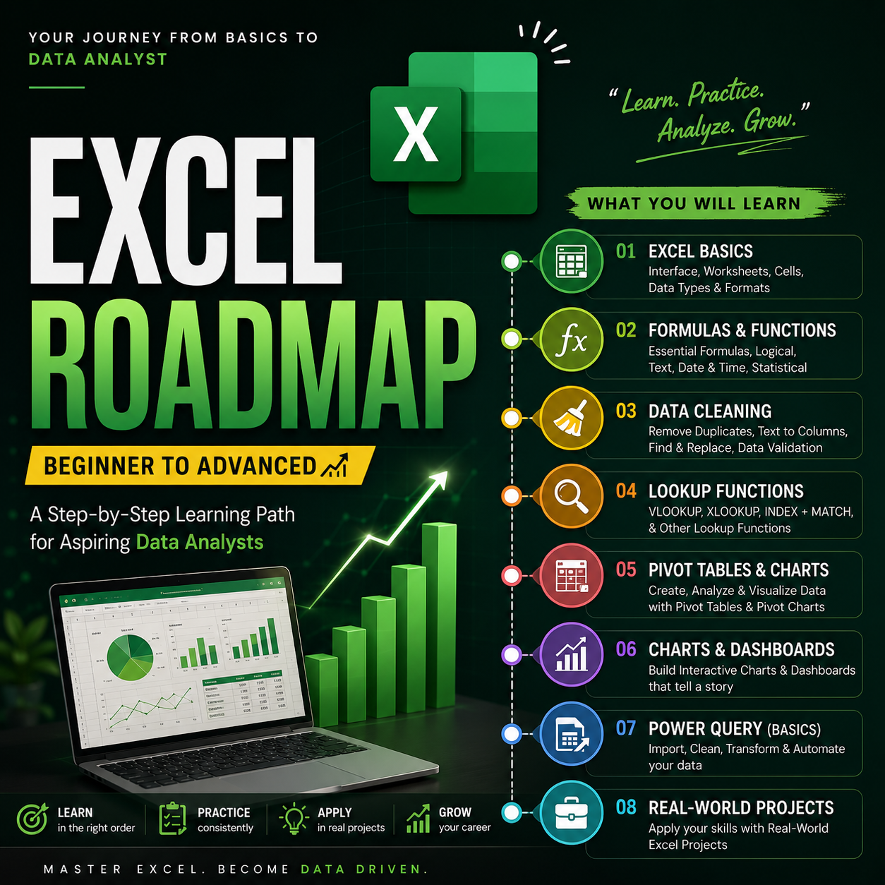
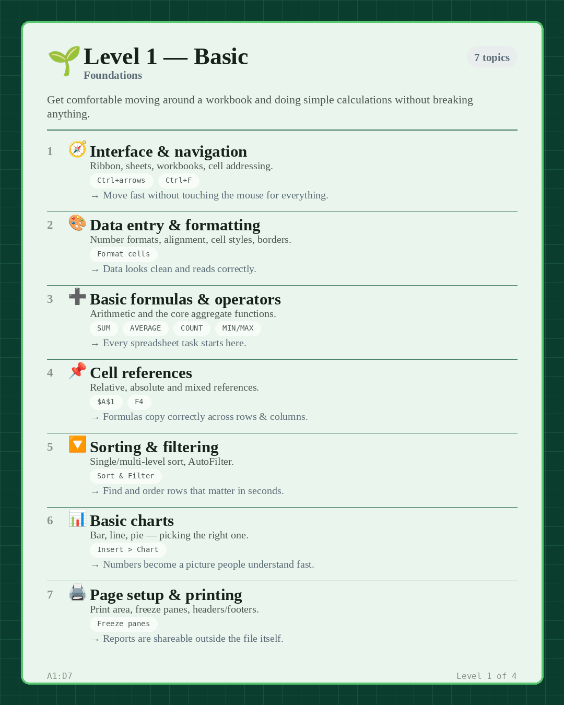
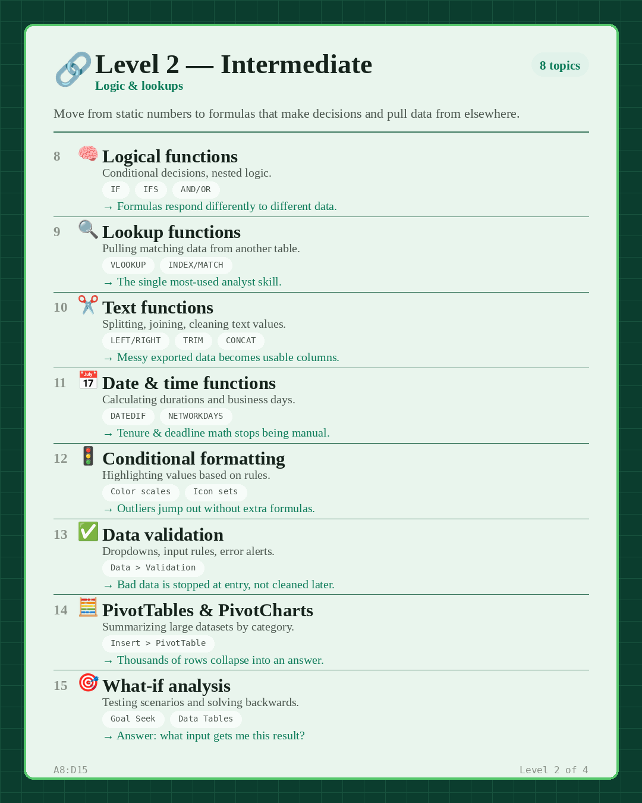
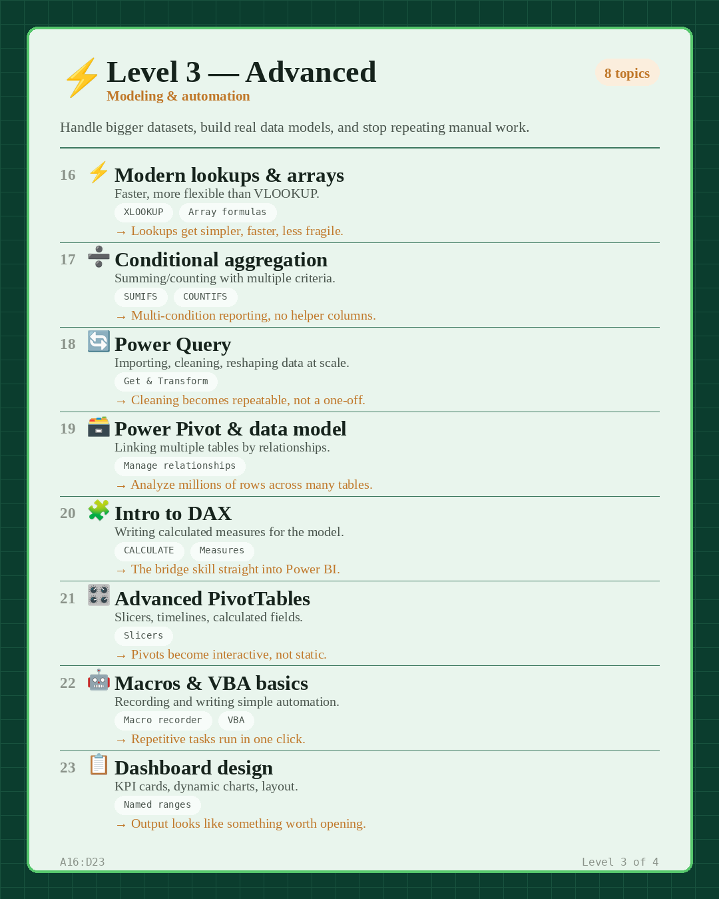
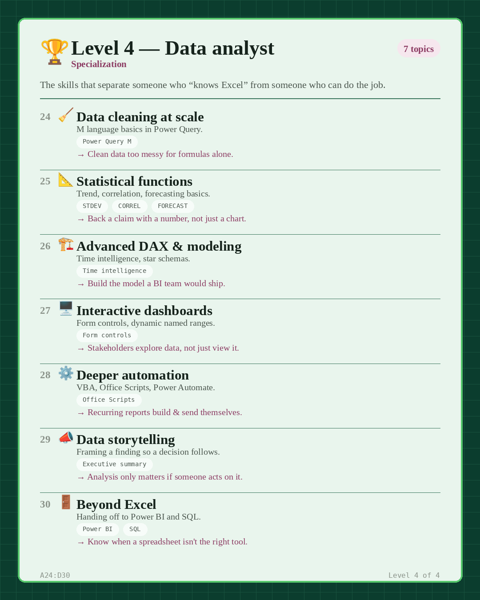
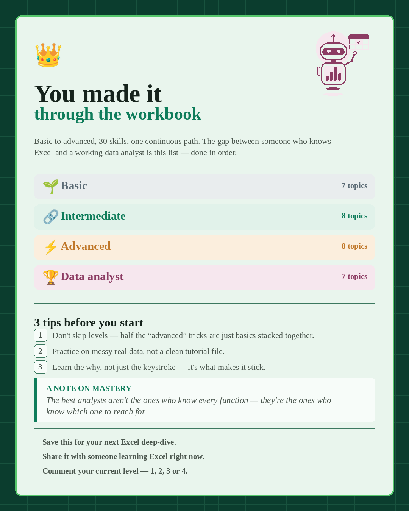

<div align="center">

# 📊 The Excel Roadmap
### From Basics to Data Analyst — One Clear Path, No Guesswork


<sub>Built by <a href="https://www.linkedin.com/in/akash-yadav-122a75288/">Akash Yadav</a> · ⭐ Star this repo if it helps you</sub>

</div>

<br>

> Most people learn Excel randomly — a `VLOOKUP` here, a pivot table there — and never see how it all connects. This roadmap is the path that actually builds on itself: **30 skills, 4 levels, zero skipped steps.**

<br>

<div align="center">



</div>

<br>

## 📑 Contents

<table>
<tr>
<td valign="top" width="50%">

- [🎯 Who This Is For](#-who-this-is-for)
- [🎓 What You'll Learn](#-what-youll-learn)
- [🪜 The 4 Levels](#-the-4-levels)
- [📈 Skill Progress](#-skill-progress)
- [🗺️ Roadmap Flow](#️-roadmap-flow)
- [📖 Full Breakdown](#-full-breakdown)

</td>
<td valign="top" width="50%">

- [🚀 How to Use This](#-how-to-use-this)
- [📚 Recommended Resources](#-recommended-resources)
- [📂 Practice Projects](#-practice-projects)
- [❓ FAQ](#-faq)
- [📥 Download](#-download)
- [👤 About the Author](#-about-the-author)

</td>
</tr>
</table>

---

## 🎯 Who This Is For

| | |
|---|---|
| 🌱 | Beginners starting Excel from zero |
| 💼 | Anyone preparing for a Data Analyst / Business Analyst role |
| 🔁 | People who "know Excel" but want to fill gaps in the right order |
| 🎓 | Students & career switchers moving into analytics |

---

## 🎓 What You'll Learn

By completing this roadmap, you'll be able to:

✅ Analyze datasets confidently
✅ Build professional Excel dashboards
✅ Use lookup, logical, and statistical functions
✅ Clean messy business data
✅ Automate repetitive work
✅ Prepare data for Power BI and SQL
✅ Be interview-ready for Data Analyst roles

---

## 🪜 The 4 Levels

<div align="center">

| Level | Focus | Topics | You'll be able to... |
|:---:|---|:---:|---|
| 🌱 **1 · Basic** | Foundations | `7` | Navigate & calculate confidently |
| 🔗 **2 · Intermediate** | Logic & Lookups | `8` | Make formulas decide & pull data |
| ⚡ **3 · Advanced** | Modeling & Automation | `8` | Build real models & automate work |
| 🏆 **4 · Data Analyst** | Specialization | `7` | Do the actual job — handoff to BI |

**`30 skills` · `4 levels` · `1 workbook of knowledge`**

</div>

---

## 📈 Skill Progress

```
🟩 Level 1 — Basic          ████████░░░░░░░░░░░░  25%
🟨 Level 2 — Intermediate   ████████████░░░░░░░░  50%
🟧 Level 3 — Advanced       ████████████████░░░░  75%
🟦 Level 4 — Data Analyst   ████████████████████ 100%
```

## 🗺️ Roadmap Flow

```text
   Basics
     ↓
  Functions
     ↓
  Lookups
     ↓
 Pivot Tables
     ↓
 Power Query
     ↓
 Dashboards
     ↓
  Power BI / SQL
```

---

## 📖 Full Breakdown

### 🌱 Level 1 — Basic
<sub>Foundations · Get comfortable moving around a workbook and calculating without breaking anything</sub>

`Interface & navigation` `Data entry & formatting` `Basic formulas` `Cell references` `Sorting & filtering` `Basic charts` `Page setup & printing`



<br>

### 🔗 Level 2 — Intermediate
<sub>Logic & Lookups · Move from static numbers to formulas that decide and pull data from elsewhere</sub>

`Logical functions` `VLOOKUP / INDEX-MATCH` `Text functions` `Date & time functions` `Conditional formatting` `Data validation` `PivotTables` `What-if analysis`



<br>

### ⚡ Level 3 — Advanced
<sub>Modeling & Automation · Handle bigger datasets, build real models, stop repeating manual work</sub>

`XLOOKUP` `SUMIFS / COUNTIFS` `Power Query` `Power Pivot` `Intro to DAX` `Advanced PivotTables` `Macros & VBA` `Dashboard design`



<br>

### 🏆 Level 4 — Data Analyst
<sub>Specialization · The skills that separate "knows Excel" from "can do the job"</sub>

`Data cleaning at scale` `Statistical functions` `Advanced DAX` `Interactive dashboards` `Deeper automation` `Data storytelling` `Power BI & SQL handoff`



<br>

### ✅ Wrap-up & Tips



---

## 🚀 How to Use This

```
1. Don't skip levels        → "advanced" tricks are just basics stacked together
2. Practice on messy data   → not a clean tutorial file
3. Learn the why             → not just the keystroke
4. One level at a time       → each one builds on the last
5. Finish Level 4             → you're ready for Power BI & SQL
```

## 📚 Recommended Resources

- [Microsoft Learn — Excel](https://learn.microsoft.com/en-us/training/browse/?products=excel)
- [ExcelJet](https://exceljet.net/)
- Leila Gharani (YouTube)
- XelPlus (YouTube)
- Practice datasets: [Kaggle](https://www.kaggle.com/datasets), government open-data portals

## 📂 Practice Projects

Apply each level with a real project:

✔ Sales Dashboard
✔ HR Analytics Dashboard
✔ Personal Finance Tracker
✔ Inventory Dashboard
✔ Student Performance Analysis
✔ Customer Churn Analysis

## ❓ FAQ

<details>
<summary><b>How long does this take?</b></summary>
<br>
A few hours a week, consistently → typically 6–10 weeks to feel solid at Level 4.
</details>

<details>
<summary><b>Excel or Google Sheets?</b></summary>
<br>
Levels 1–2 work fine in Google Sheets. Power Query, Power Pivot, and VBA (Level 3–4) are Excel-specific.
</details>

<details>
<summary><b>I already know some of this — can I skip ahead?</b></summary>
<br>
Skim each level's topic list first — it's common to have gaps in a level you think you "know."
</details>

## 📥 Download

<div align="center">

[](excel-roadmap.pdf)
[](01-cover.png)

</div>

---

## ⭐ Star History

[](https://star-history.com/#akxyverse/excel-roadmap&Date)

---

## 👤 About the Author

<div align="center">

### Akash Yadav

<a href="https://git.io/typing-svg">
  
</a>

Built this roadmap to give a clear, ordered path for learning Excel with data analysis as the goal.

**🎯 Aspirant Data Analyst** · 📍 India 🇮🇳 · 🔭 Focus: Data Cleaning · EDA · Visualization · Dashboards


[](https://www.linkedin.com/in/akash-yadav-122a75288/)
[](mailto:akashydav110502@gmail.com)
[](https://github.com/akxyverse)

</div>

---

## 💬 Feedback & Contributions

Found a mistake or have a suggestion? Open an issue or a pull request — contributions are welcome.

If this helped you, ⭐ **star this repo** so others can find it too.

## 📜 License

Free to use, share, and adapt for personal or educational purposes. Attribution appreciated but not required.

<br>

<div align="center">

⭐ Learn Excel the right way.
📊 Build real projects.
🚀 Become a Data Analyst.

**Happy Learning!**

Made with 💚 by [Akash Yadav](https://www.linkedin.com/in/akash-yadav-122a75288/)

</div>
